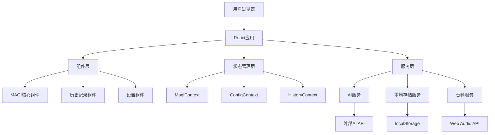
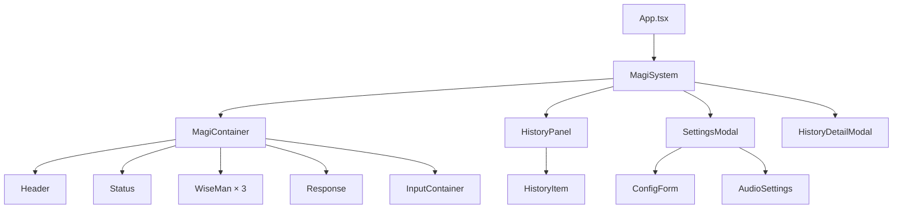

# 设计文档

## 概述

本设计文档详细描述了MAGI系统从Dash框架到React+Vite框架的重构设计。该系统是一个基于《新世纪福音战士》中超级计算机系统的Web应用，通过三个不同AI人格（科学家、母亲、女人）对用户问题进行分析和决策。重构后的系统将完全在前端运行，使用现代React技术栈，同时保持原有的EVA风格视觉设计和功能特性。

## 架构

### 整体架构设计

系统采用现代前端单页应用(SPA)架构，完全运行在浏览器中：



### 技术栈架构

- **前端框架**: React 19.2 + TypeScript 6.0
- **构建工具**: Vite 6.5
- **状态管理**: React Context API + useReducer
- **样式方案**: CSS Modules + CSS变量
- **HTTP客户端**: 原生fetch API
- **音频处理**: Web Audio API
- **本地存储**: localStorage API

## 组件和接口

### 核心组件层次结构



### 组件接口设计

#### MagiSystem (根组件)
```typescript
interface MagiSystemProps {
  // 无props，作为应用根组件
}

interface MagiSystemState {
  currentQuestion: string;
  systemStatus: 'standby' | 'processing' | 'completed';
  isHistoryOpen: boolean;
  isSettingsOpen: boolean;
}
```

#### WiseMan (贤者组件)
```typescript
interface WiseManProps {
  name: 'melchior' | 'balthasar' | 'casper';
  status: 'standby' | 'processing' | 'yes' | 'no' | 'conditional' | 'info' | 'error';
  orderNumber: 1 | 2 | 3;
  onClick?: () => void;
}
```

#### Response (响应组件)
```typescript
interface ResponseProps {
  status: 'standby' | 'processing' | 'yes' | 'no' | 'conditional' | 'info' | 'error';
  finalDecision?: string;
}
```

#### HistoryPanel (历史面板)
```typescript
interface HistoryPanelProps {
  records: HistoryRecord[];
  isOpen: boolean;
  onToggle: () => void;
  onRecordSelect: (record: HistoryRecord) => void;
  onClearHistory: () => void;
}
```

### Context接口设计

#### MagiContext
```typescript
interface MagiContextType {
  // 状态
  question: string;
  questionType: 'yes_no' | 'info';
  systemStatus: SystemStatus;
  wiseManAnswers: WiseManAnswer[];
  finalStatus: FinalStatus;
  refreshTrigger: number;
  
  // 操作
  setQuestion: (question: string) => void;
  processQuestion: () => Promise<void>;
  resetSystem: () => void;
}
```

#### ConfigContext
```typescript
interface ConfigContextType {
  // 状态
  provider: AIProvider;
  model: string;
  apiKey: string;
  apiBase?: string;
  
  // 操作
  updateConfig: (config: Partial<UserConfig>) => void;
  clearConfig: () => void;
}
```

#### HistoryContext
```typescript
interface HistoryContextType {
  // 状态
  records: HistoryRecord[];
  selectedRecord: HistoryRecord | null;
  
  // 操作
  addRecord: (record: HistoryRecord) => void;
  selectRecord: (record: HistoryRecord) => void;
  clearHistory: () => void;
  deleteRecord: (id: string) => void;
}
```

## 数据模型

### 核心数据类型

#### 用户配置
```typescript
interface UserConfig {
  provider: 'openrouter' | 'openai' | 'anthropic' | 'google' | 'zhipu' | 'moonshot' | 'alibaba' | 'baidu' | 'deepseek';
  model: string;
  apiKey: string;
  apiBase?: string;
}
```

#### 历史记录
```typescript
interface HistoryRecord {
  id: string;
  timestamp: number;
  question: string;
  questionType: 'yes_no' | 'info';
  finalStatus: 'yes' | 'no' | 'conditional' | 'info' | 'error';
  answers: WiseManAnswer[];
}

interface WiseManAnswer {
  name: 'melchior' | 'balthasar' | 'casper';
  status: 'yes' | 'no' | 'conditional' | 'info' | 'error';
  response: string;
  conditions?: string[];
}
```

#### 系统状态
```typescript
type SystemStatus = 'standby' | 'processing' | 'completed';
type FinalStatus = 'yes' | 'no' | 'conditional' | 'info' | 'error';
type AIProvider = 'openrouter' | 'openai' | 'anthropic' | 'google' | 'zhipu' | 'moonshot' | 'alibaba' | 'baidu' | 'deepseek';
```

### 本地存储数据结构

#### 历史记录存储格式
```typescript
interface HistoryStorage {
  version: string;
  records: HistoryRecord[];
  lastUpdated: number;
}
```

#### 配置存储格式
```typescript
interface ConfigStorage {
  version: string;
  userConfig: UserConfig;
  audioSettings: {
    enabled: boolean;
    volume: number;
  };
  lastUpdated: number;
}
```

## 错误处理

### 错误类型定义

```typescript
enum ErrorType {
  NETWORK_ERROR = 'NETWORK_ERROR',
  API_KEY_INVALID = 'API_KEY_INVALID',
  API_QUOTA_EXCEEDED = 'API_QUOTA_EXCEEDED',
  STORAGE_UNAVAILABLE = 'STORAGE_UNAVAILABLE',
  AUDIO_UNAVAILABLE = 'AUDIO_UNAVAILABLE',
  UNKNOWN_ERROR = 'UNKNOWN_ERROR'
}

interface AppError {
  type: ErrorType;
  message: string;
  details?: any;
}
```

### 错误处理策略

1. **API调用错误**
   - 网络错误：显示重试选项
   - 认证错误：提示用户检查API密钥
   - 配额超限：显示明确的错误信息
   - 单个AI失败：继续处理其他AI响应

2. **存储错误**
   - localStorage不可用：降级到内存存储
   - 数据损坏：重置为默认状态

3. **音频错误**
   - Web Audio API不支持：禁用音频功能
   - 用户未授权：提示用户交互后启用

### 错误边界组件

```typescript
interface ErrorBoundaryState {
  hasError: boolean;
  error?: AppError;
}

class ErrorBoundary extends React.Component<React.PropsWithChildren<{}>, ErrorBoundaryState> {
  // 实现错误捕获和恢复逻辑
}
```

## 测试策略

### 单元测试

使用Jest + React Testing Library进行组件和服务的单元测试：

1. **组件测试**
   - 渲染测试：确保组件正确渲染
   - 交互测试：测试用户交互行为
   - 状态测试：验证状态变化

2. **服务测试**
   - AI服务：模拟API调用和响应处理
   - 存储服务：测试数据持久化
   - 音频服务：测试音效播放逻辑

3. **Hook测试**
   - 自定义Hook的行为验证
   - 状态管理逻辑测试

### 集成测试

1. **端到端流程测试**
   - 完整的问答流程
   - 历史记录管理
   - 配置管理

2. **错误场景测试**
   - 网络异常处理
   - API错误处理
   - 存储异常处理

### 测试覆盖率目标

- 组件测试覆盖率：≥90%
- 服务层测试覆盖率：≥95%
- 整体代码覆盖率：≥85%

## 性能优化设计

### 前端性能优化

1. **代码分割**
   ```typescript
   // 懒加载非核心组件
   const SettingsModal = React.lazy(() => import('./components/SettingsModal'));
   const HistoryDetailModal = React.lazy(() => import('./components/HistoryDetailModal'));
   ```

2. **渲染优化**
   ```typescript
   // 使用React.memo防止不必要的重渲染
   const WiseMan = React.memo<WiseManProps>(({ name, status, orderNumber }) => {
     // 组件实现
   });
   
   // 使用useMemo缓存计算结果
   const finalDecision = useMemo(() => {
     return calculateFinalDecision(wiseManAnswers);
   }, [wiseManAnswers]);
   ```

3. **资源优化**
   - 字体文件预加载
   - 图片资源优化
   - CSS文件合并和压缩

### API调用优化

1. **请求缓存**
   ```typescript
   interface CacheEntry {
     question: string;
     responses: WiseManAnswer[];
     timestamp: number;
     ttl: number;
   }
   
   class ResponseCache {
     private cache = new Map<string, CacheEntry>();
     
     get(question: string): WiseManAnswer[] | null {
       // 实现缓存逻辑
     }
     
     set(question: string, responses: WiseManAnswer[]): void {
       // 实现缓存存储
     }
   }
   ```

2. **请求去重**
   - 防止短时间内重复请求
   - 实现请求队列管理

3. **错误重试**
   ```typescript
   async function retryRequest<T>(
     fn: () => Promise<T>,
     maxRetries: number = 3,
     delay: number = 1000
   ): Promise<T> {
     // 实现指数退避重试逻辑
   }
   ```

## 安全考虑

### 数据安全

1. **API密钥保护**
   - 仅存储在localStorage中
   - 不在网络请求中暴露
   - 提供清除功能

2. **输入验证**
   ```typescript
   function validateUserInput(input: string): boolean {
     // 验证输入长度和内容
     return input.length > 0 && input.length <= 1000;
   }
   ```

3. **XSS防护**
   - 使用React的内置XSS保护
   - 对用户输入进行转义
   - 避免使用dangerouslySetInnerHTML

### 隐私保护

1. **本地存储**
   - 所有数据仅存储在用户本地
   - 不向第三方服务发送用户数据
   - 提供数据清除功能

2. **网络请求**
   - 仅向用户配置的AI服务发送请求
   - 不收集用户使用统计
   - 支持自定义API端点

## 可访问性设计

### 键盘导航

1. **Tab顺序**
   - 逻辑的Tab键导航顺序
   - 焦点指示器清晰可见
   - 支持Escape键关闭模态框

2. **快捷键**
   - Enter键提交问题
   - Ctrl+/ 打开设置
   - Ctrl+H 打开历史记录

### 屏幕阅读器支持

1. **语义化HTML**
   ```typescript
   <main role="main" aria-label="MAGI决策系统">
     <section aria-label="问题输入区域">
       <label htmlFor="question-input">请输入您的问题</label>
       <input id="question-input" aria-describedby="input-help" />
     </section>
   </main>
   ```

2. **ARIA属性**
   - aria-live区域用于状态更新
   - aria-expanded用于可折叠内容
   - aria-describedby用于关联描述

### 视觉辅助

1. **颜色对比度**
   - 确保文本与背景的对比度≥4.5:1
   - 重要信息不仅依赖颜色传达

2. **字体大小**
   - 支持浏览器字体缩放
   - 最小字体大小16px

## 国际化设计

### 多语言支持架构

```typescript
interface I18nConfig {
  locale: string;
  messages: Record<string, string>;
}

interface I18nContextType {
  locale: string;
  t: (key: string, params?: Record<string, any>) => string;
  setLocale: (locale: string) => void;
}
```

### 支持的语言

1. **初期支持**
   - 中文（简体）- 默认
   - 英文
   - 日文

2. **扩展计划**
   - 中文（繁体）
   - 韩文
   - 其他语言

### 文本外部化

```typescript
// 语言文件结构
const zh_CN = {
  'system.title': 'MAGI决策系统',
  'wise_man.melchior': 'MELCHIOR-1 (科学家)',
  'wise_man.balthasar': 'BALTHASAR-2 (母亲)',
  'wise_man.casper': 'CASPER-3 (女人)',
  'status.standby': '待机中...',
  'status.processing': '处理中...',
  // 更多翻译...
};
```

## 部署和运维

### 构建配置

```typescript
// vite.config.ts
export default defineConfig({
  plugins: [react()],
  build: {
    target: 'es2020',
    outDir: 'dist',
    sourcemap: true,
    rollupOptions: {
      output: {
        manualChunks: {
          vendor: ['react', 'react-dom'],
          audio: ['./src/services/audioService.ts'],
        }
      }
    }
  },
  server: {
    port: 3000,
    host: true
  }
});
```

### 环境配置

1. **开发环境**
   - 热重载
   - 详细错误信息
   - 开发工具集成

2. **生产环境**
   - 代码压缩
   - 资源优化
   - 错误边界

### 监控和日志

```typescript
interface LogEntry {
  level: 'info' | 'warn' | 'error';
  message: string;
  timestamp: number;
  context?: any;
}

class Logger {
  static log(level: LogEntry['level'], message: string, context?: any): void {
    // 实现日志记录逻辑
  }
}
```

## 迁移计划

### 数据迁移

1. **现有数据兼容**
   - 检测旧版本数据格式
   - 自动转换为新格式
   - 保留用户历史记录

2. **配置迁移**
   - 从旧版本导入API配置
   - 迁移音频设置
   - 保持用户偏好

### 功能对比

| 功能 | Dash版本 | React版本 | 迁移状态 |
|------|----------|-----------|----------|
| 三贤者问答 | ✅ | ✅ | 完全兼容 |
| 历史记录 | ✅ | ✅ | 增强功能 |
| 音频效果 | ✅ | ✅ | 完全兼容 |
| 多AI支持 | ✅ | ✅ | 完全兼容 |
| 响应式设计 | ❌ | ✅ | 新增功能 |
| 离线缓存 | ❌ | ✅ | 新增功能 |

### 回滚计划

1. **版本控制**
   - 保留Dash版本作为备份
   - 支持快速回滚
   - 数据兼容性保证

2. **用户通知**
   - 迁移前通知用户
   - 提供使用指南
   - 收集用户反馈