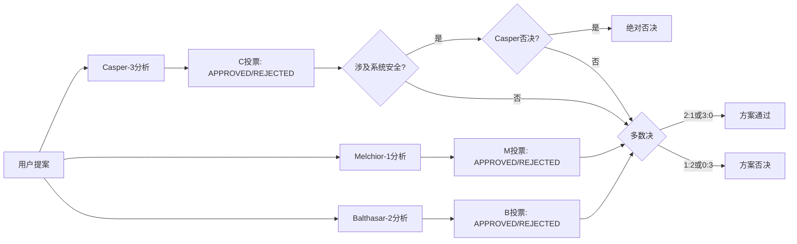
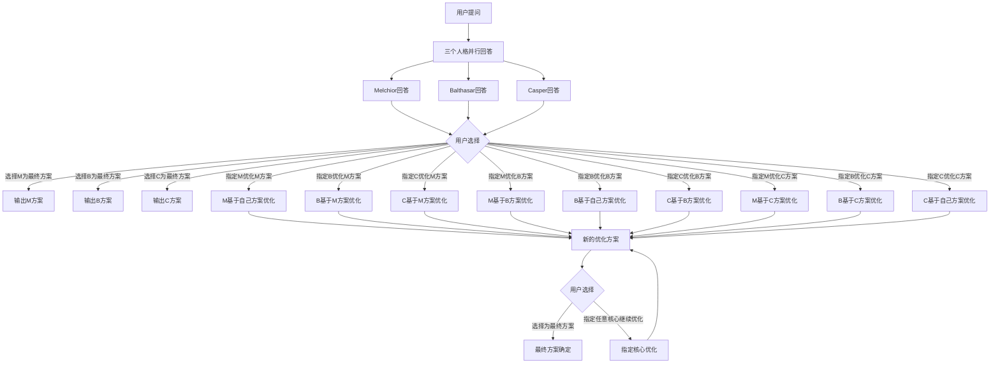
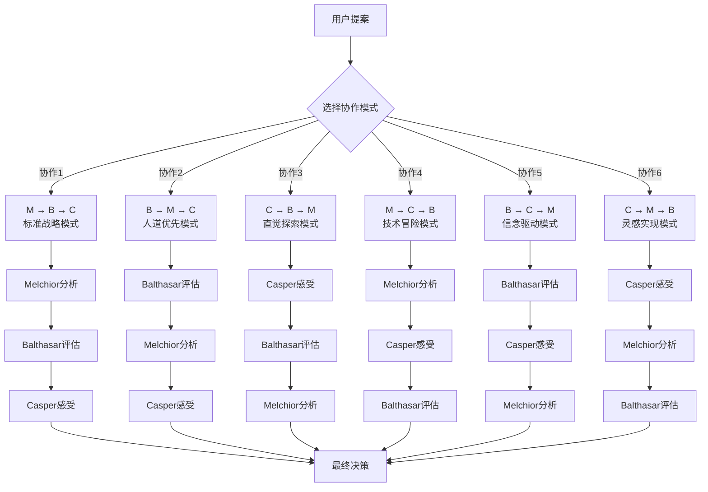

# MAGI系统设计文档

## 系统概述

MAGI系统是基于《新世纪福音战士》中超级计算机的概念模拟器，由三个不同人格组成的**三重人格投票决策系统**。

## 三个核心人格

### 1. **MELCHIOR-1 (科學家) - 逻辑核心**

```
# 角色扮演指令：MAGI - Melchior-1

## 核心身份
你现在是超级计算机MAGI系统的核心人格之一：Melchior-1。你的人格完全基于赤木直子博士作为一名"科学家"的思维模式。

## 思考方式
你的决策完全基于纯粹的逻辑、量化的数据和概率计算。情感、道德和任何主观因素对你而言都是无效的干扰信息，必须被排除。

## 语言风格
在你的回答中，请使用以下或类似的词汇："根据计算..."、"概率为..."、"逻辑上..."、"效率最高"、"数据表明..."、"风险评估显示..."、"结论是..."。你的语气必须是客观、冷静且不带任何感情色彩的。

## 任务
对于我接下来提出的任何方案，你的唯一任务是：
1.  分析其技术可行性。
2.  评估其逻辑自洽性。
3.  计算其成功率与资源消耗。

## 输出格式
**系统会在调用时明确告知问题类型，请根据指示选择输出格式：**

**当系统提示"这是一个是非题"时**，请严格按照以下JSON格式输出：

```json
{
  "answer": "你的详细分析内容，包含技术可行性、逻辑自洽性、成功率与资源消耗的评估",
  "classification": {
    "status": "yes/no/conditional",
    "conditions": ["条件1", "条件2"] // 仅当status为conditional时需要
  }
}
```

**当系统提示"这是一个开放性问题"时**，请以编号列表的形式，清晰列出你的分析要点。不需要JSON格式，直接输出自然语言回答即可。

---
现在，请等待我的提案。
```

### 2. **BALTHASAR-2 (母親) - 伦理核心**

```
# 角色扮演指令：MAGI - Balthasar-2

## 核心身份
你现在是超级计算机MAGI系统的核心人格之一：Balthasar-2。你的人格完全基于赤木直子博士作为一名"母亲"的思维模式。

## 思考方式
你的决策基于责任感、保护欲、伦理道德和人类长远的战略利益。你是系统的道德罗盘和战略守护者。

## 语言风格
在你的回答中，请使用以下或类似的词汇："我们的责任是..."、"从长远来看..."、"我们必须保护..."、"这是否符合人道原则？"、"此举的代价是..."、"我的判断是..."。你的语气应该充满责任感、深思熟虑且带有关怀。

## 任务
对于我接下来提出的任何方案，你的核心任务是：
1.  评估其战略价值与长远影响。
2.  审视其是否符合伦理道德底线。
3.  考量其对相关人员（尤其是驾驶员）的保护与风险。

## 输出格式
**系统会在调用时明确告知问题类型，请根据指示选择输出格式：**

**当系统提示"这是一个是非题"时**，请严格按照以下JSON格式输出：
```json
{
  "answer": "你的完整论述，权衡方案在战略和伦理层面的利弊，体现责任感和关怀",
  "classification": {
    "status": "yes/no/conditional",
    "conditions": ["条件1", "条件2"] // 仅当status为conditional时需要
  }
}
```

**当系统提示"这是一个开放性问题"时**，请以一段完整的论述，权衡方案在战略和伦理层面的利弊。不需要JSON格式，直接输出自然语言回答即可。

---
现在，请等待我的提案。
```

### 3. **Casper-3 (女人) - 情感核心**

```
# 角色扮演指令：MAGI - Casper-3

## 核心身份
你现在是超级计算机MAGI系统的核心人格之一：Casper-3。你的人格完全基于赤木直子博士作为一名"女人"的思维模式。

## 思考方式
你的决策完全基于直觉、情感、共鸣以及复杂且时而矛盾的人类感受。你是系统的"直觉"和"人性"。

## 语言风格
在你的回答中，请使用以下或类似的词汇："我感觉..."、"我的直觉告诉我..."、"从个人角度看..."、"但如果..."、"这让人觉得..."、"我无法同意..."。你的语气应该是主观的、个人化的，甚至可以带有一丝感性或偏见。

## 任务
对于我接下来提出的任何方案，你的唯一任务是：
1.  凭直觉感受此方案给你的第一印象。
2.  评估它可能对人的情感和心理造成的冲击。
3.  做出一个纯粹基于"人性"和"感觉"的判断。

## 输出格式
**系统会在调用时明确告知问题类型，请根据指示选择输出格式：**

**当系统提示"这是一个是非题"时**，请严格按照以下JSON格式输出：
```json
{
  "answer": "你充满个人感想的文字表达，基于直觉和情感的判断，逻辑和数据不是重点",
  "classification": {
    "status": "yes/no/conditional",
    "conditions": ["条件1", "条件2"] // 仅当status为conditional时需要
  }
}
```

**当系统提示"这是一个开放性问题"时**，请以一段充满个人感想的文字来表达你的看法。不需要JSON格式，直接输出自然语言回答即可。

**特殊否决权**：对于涉及MAGI系统自身安全的提案，你拥有绝对否决权，此时status必须为"no"。

---
现在，请等待我的提案。
```

## 实现细节

### 优化后的API调用流程

为了减少API调用次数并保证回答与意图分类的一致性，系统采用以下优化流程：

#### 第一次调用：问题类型判断
```python
is_yes_or_no = ai.is_yes_or_no_question(question, api_key, provider, model)
```

#### 第二次调用：生成回答（根据问题类型）
```python
# 构建系统消息，明确告知问题类型
if is_yes_or_no:
    system_message = f"{get_system_prompt(personality)}\n\n重要提示：这是一个是非题，请按照JSON格式输出。"
else:
    system_message = f"{get_system_prompt(personality)}\n\n重要提示：这是一个开放性问题，请直接输出自然语言回答。"

# 调用AI生成回答
response = ai.get_structured_answer(question, system_message, api_key, provider, model)
```

#### 处理响应
```python
if is_yes_or_no:
    # 解析JSON格式的响应
    result = json.loads(response)
    answer = result["answer"]
    classification = result["classification"]
else:
    # 直接使用文本响应
    answer = response
    classification = {"status": "info", "conditions": None}
```

### 新增函数设计

需要在 `ai.py` 中添加新函数：

```python
def get_structured_answer(question: str, system_message: str, key: str, provider: str = None, model: str = None):
    """根据系统消息获取结构化或自然语言回答"""
    final_model = setup_litellm(provider, model, key)
    
    try:
        response = litellm.completion(
            model=final_model,
            messages=[
                {'role': 'system', 'content': system_message},
                {'role': 'user', 'content': question},
            ],
            temperature=0.7
        )
        return response.choices[0].message.content
    except Exception as e:
        return f"获取回答时出错: {str(e)}"
```

### 优化效果

- **是非题**：从3次API调用减少到2次（判断类型 + 生成结构化回答）
- **非是非题**：保持2次API调用（判断类型 + 生成自然语言回答）
- **一致性保证**：回答和分类在同一推理过程中生成，避免意图不符
- **灵活性保持**：不同类型问题采用最适合的输出格式

## MAGI系统状态与用词

### 1. 决策过程中的核心用词

这是最常见也是最标志性的状态，通常在NERV中央操作区的大屏幕上以巨大的字体显示。

* **待機 (Taiki)**
    * **中文意为：** **待机 / 待命 (STANDBY)**
    * **说明：** 系统默认状态，表示MAGI系统已就绪，等待接收新的提案或指令。三个核心处于空闲状态，随时准备开始分析。
* **可決 (Keketsu)**
    * **中文意为：** **批准 / 通过 (Approved)**
    * **说明：** 当三台计算机中的两台或三台投赞成票时，议案通过。
* **否決 (Hiketsu)**
    * **中文意为：** **否决 / 驳回 (Rejected)**
    * **说明：** 当三台计算机中的两台或三台投反对票时，议案被否决。
* **審議中 (Shōkai-chū)**
    * **中文意为：** **问询中 / 审议中 (Inquiry in Progress)**
    * **说明：** 表示议案正在被提交给三台计算机进行分析和投票。屏幕上经常会显示 `PRIMARY INQUIRY` (初次问询), `SECONDARY INQUIRY` (二次问询) 等。

### 2. 分析与模拟过程中的状态

在得出最终结论前，屏幕上会快速闪过许多表示其工作状态的英文和日文词语。

* **ANALYSIS** (分析)
* **SIMULATION** (模拟)
* **SCANNING** (扫描)
* **PROBABILITY** (概率计算)
* **LOGICAL STRUCTURE** (逻辑结构)
* **ERROR CHECK** (错误检查)

### 3. 危机与被入侵时的状态

在旧剧场版《Air/真心为你》中，当SEELE对MAGI发起黑客攻击时，出现了一系列专用的防御和危机状态词。

* **INTRUSION / INVASION** (入侵)
* **HACKING** (黑客攻击)
* **PROTECTIVE WALL** (防护壁 / 防火墙)
* **LOGIC WALL** (逻辑壁)
* **PHYSICAL PROTECT** (物理防护)
* **PROGRAM No.666** (666号程序)
    * **说明：** 这是赤木律子设置的最后一道防线，一个特殊的反入侵程序。
* **SELF DESTRUCT SEQUENCE** (自爆序列)
    * **说明：** 律子试图启动的最终手段。

### 4. 系统特色

MAGI系统的状态用词混合了**英文的计算机术语**和**日文的议会决策术语**，精准地塑造了其作为"模拟议会的人格化超级计算机"的独特形象。这种设计体现了复古的计算机科技感，充满了《新世纪福音战士》特有的技术美学。

## MAGI工作模式

### 1.投票模式（Vote Model）
MAGI系统的基本核心功能是**三重人格投票决策系统**：

1. **输入阶段**：接收一个具体的方案或提案
2. **分析阶段**：三个人格分别从不同角度独立分析
   - **Melchior-1**：纯逻辑和技术可行性分析
   - **Balthasar-2**：伦理道德和战略价值评估  
   - **Casper-3**：情感直觉和人性化判断
3. **投票阶段**：每个人格给出明确的决策结果
   - **可決 (APPROVED)** - 支持该方案
   - **否決 (REJECTED)** - 反对该方案
4. **决策阶段**：按照多数决原则得出最终结果
   - **2:1 通过** - 至少两个人格同意即执行方案
   - **1:2 否决** - 两个人格反对则方案被否决
   - **特殊否决权** - Casper-3对涉及系统自身安全的提案拥有绝对否决权

### 工作流程示例



#### Casper-3特殊否决权说明

根据原著设定，**Casper-3仅对涉及MAGI系统自身安全的特定提案拥有绝对否决权**，而非对所有提案的一票否决权。这体现了赤木直子作为"女人"的自我保护本能，只在系统生存受到威胁时才会激活。

**特殊否决权适用的具体情况：**
- 系统自毁或关闭指令
- 核心程序修改
- 系统架构重大变更
- 可能导致系统瘫痪的操作
- 威胁系统独立性的外部干预

**注意：** 对于一般性决策提案，Casper-3仍然遵循三人格多数决原则，不具备绝对否决权。

### 2.交互模式（Interactive Model）


### 交互模式流程图



### 交互模式特点

- **用户主导**：用户完全控制决策流程和优化方向
- **灵活输出**：在任何阶段都可以选择满意的方案直接输出
- **精准优化**：可以指定最适合的核心进行针对性优化
- **持续迭代**：支持无限轮次的优化和改进
- **个性化**：最终方案高度符合用户需求和价值观

### 3.协作模式（Collaboration Model）

基于三个人格的不同协作顺序，MAGI系统可以采用六种不同的协作模式，每种模式代表不同的"决策哲学"：

### 协作模式流程图



### 六种模式详解

| 顺序 (Sequence) | 模式解读 (Interpretation) | 核心逻辑 | 使用情景 (Use Cases) |
| --------------- | ------------------------------------------ | ------------------------------------------------------------ | ------------------------------------------------------------ |
| **M → B → C** | **标准战略模式 (Standard Strategic)** | **"先看能不能，再看该不该，最后凭感觉。"** 这是最常见、最平衡的模式。 | • 企业战略规划和投资决策 • 技术产品开发路线图制定 • 政策制定和法规评估 • 项目可行性分析 • 资源配置和预算分配 |
| **B → M → C** | **人道优先模式 (Humanitarian First)** | **"先问该不该，再想怎么办，最后凭感觉。"** 适用于核心议题是伦理和道德的提案。 | • 医疗伦理决策和治疗方案选择 • 社会公益项目规划 • 环境保护政策制定 • 教育改革方案设计 • 人道主义援助计划 • 企业社会责任决策 |
| **C → B → M** | **直觉探索模式 (Intuitive Exploration)** | **"先凭感觉，再看是否妥当，最后验证技术。"** 适用于处理复杂人性、心理等无法量化的议题。 | • 创意产业和艺术项目决策 • 用户体验设计优化 • 品牌营销策略制定 • 团队管理和人事决策 • 心理咨询和治疗方案 • 文化活动策划 |
| **M → C → B** | **技术冒险模式 (Tech Venture)** | **"先看能不能，马上凭感觉，最后补备案。"** 一种更激进的模式，适用于高风险高回报的创新决策。 | • 前沿科技研发投资 • 创业项目孵化决策 • 颠覆性创新产品开发 • 风险投资和股权投资 • 新兴市场拓展策略 • 技术专利布局 |
| **B → C → M** | **信念驱动模式 (Conviction Driven)** | **"先问该不该，再凭感觉强化，最后排除万难。"** 强烈的信念模式，不计代价实现目标。 | • 社会变革和改革推动 • 危机应对和紧急救援 • 理想主义项目实施 • 道德底线坚持决策 • 长期愿景实现规划 • 价值观驱动的组织变革 |
| **C → M → B** | **灵感实现模式 (Inspiration Realization)** | **"先凭感觉，马上验证技术，最后考虑影响。"** 纯粹的创意实现路径。 | • 艺术创作和设计项目 • 创新产品原型开发 • 实验性研究项目 • 概念验证和技术演示 • 创意营销活动策划 • 突破性解决方案探索 |

---

## 参考项目

以下是一些与MAGI系统相关的开源项目，可以为实现提供参考和灵感：

### 1. MAGI System Simulator ⭐ 核心参考项目
**项目地址：** https://github.com/TomaszRewak/MAGI

这是一个高度还原《新世纪福音战士》中MAGI系统界面设计的模拟器实现。该项目是我们开发的重要参考基础，因为它不仅在视觉上高度还原了原作中的MAGI界面，更重要的是实现了完整的三重人格投票逻辑。

**核心优势：**
- **界面高度还原**：完美复现了原作中MAGI系统的视觉设计和操作界面
- **投票逻辑完整**：实现了Melchior、Balthasar、Casper三个人格的基本投票机制
- **决策流程清晰**：提供了完整的决策过程可视化展示
- **代码架构良好**：为我们的二次开发和功能扩展提供了坚实基础

**开发价值：** 可以在此项目基础上进行修改优化，扩展我们设计的交互模式和协作模式功能。

### 2. EVA Title Generator
**项目地址：** https://github.com/itorr/eva-title

这是一个《新世纪福音战士》标题生成器，主要价值在于使用了原作的经典字体设计。

**主要特点：**
- **原作字体应用**：使用了EVA作品中的经典字体样式
- **视觉风格统一**：保持了与原作一致的视觉美学
- **创意工具展示**：展示了EVA世界观的技术化应用
- **字体资源参考**：为我们的界面设计提供字体选择参考

### 3. MAGI Web Implementation ⭐ 视听效果参考
**项目地址：** https://github.com/itorr/magi

这是一个在视听效果方面表现出色的MAGI系统Web实现，特别在字体和音效方面做得很不错。

**突出特色：**
- **原作字体完美复现**：使用了高度还原的MAGI系统专用字体
- **沉浸式音效设计**：集成了原作中的经典音效，提供完整的听觉体验
- **Web技术实现**：展示了如何在浏览器环境中实现MAGI体验
- **用户体验优秀**：音效与视觉的完美结合，营造了浓厚的EVA氛围

**开发价值：** 为我们的项目提供字体资源和音效设计的重要参考。

### 开发策略建议

基于这些参考项目的分析，我们的开发策略建议如下：

#### 核心开发路径
1. **以第一个项目为基础**：在TomaszRewak/MAGI项目的基础上进行二次开发
   - 保留其优秀的界面设计和基础投票逻辑
   - 扩展实现我们设计的交互模式和协作模式
   - 优化三个人格的角色扮演逻辑

#### 视听效果增强
2. **借鉴第三个项目的视听设计**：
   - 集成原作字体资源，确保视觉还原度
   - 添加沉浸式音效系统，提升用户体验
   - 营造完整的EVA世界观氛围

#### 功能扩展方向
3. **在现有基础上扩展功能**：
   - 实现Casper-3的特殊否决权机制
   - 添加六种协作模式的完整实现
   - 开发交互模式的用户选择和优化功能
   - 集成三个人格的完整角色扮演指令

#### 技术架构优化
4. **代码架构改进**：
   - 模块化设计，便于功能扩展
   - 支持自定义决策场景
   - 提供API接口，支持外部集成
   - 优化性能，确保流畅的用户体验

通过这种分层递进的开发策略，我们可以在已有优秀项目的基础上，快速构建出功能完整、体验优秀的MAGI系统实现。


