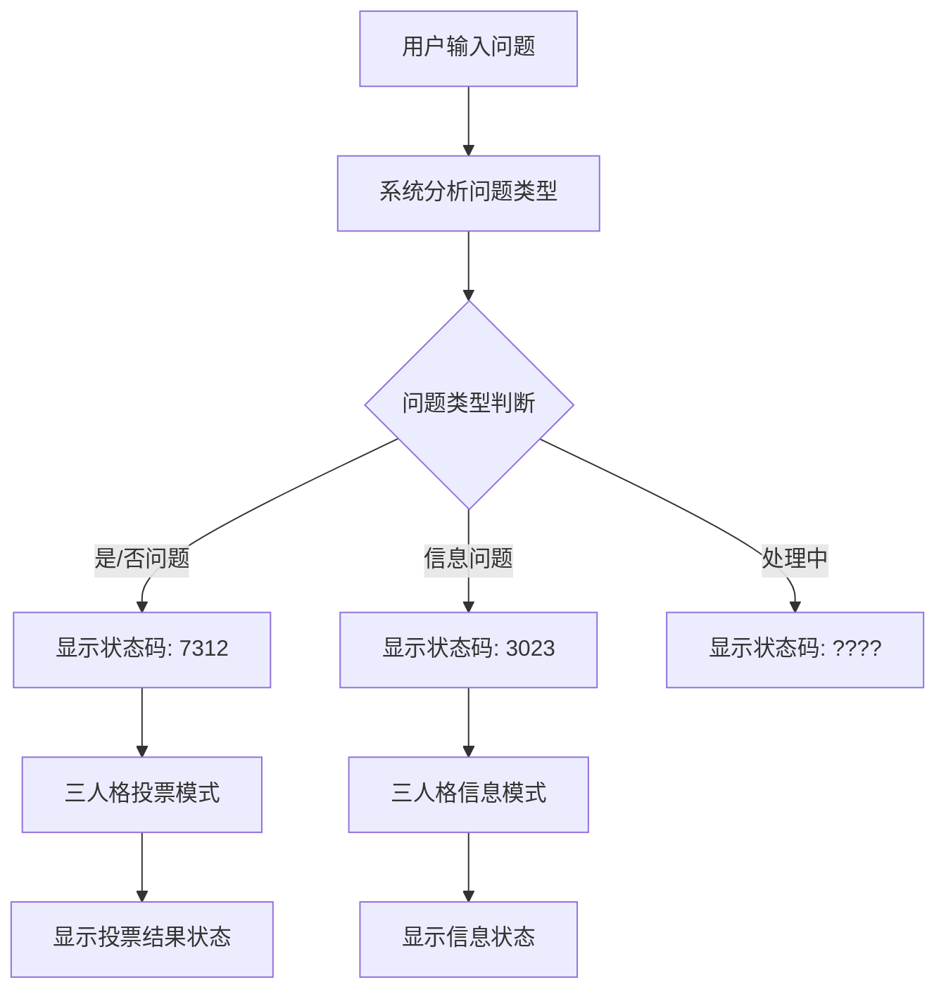

# MAGI系统状态码说明文档

## 概述

MAGI系统在处理问题时会显示不同的状态码，这些状态码反映了系统的当前处理状态和最终决策结果。本文档详细说明了各种状态码的含义和触发条件。

## 状态码分类

### 1. 处理状态码

#### 1.1 系统扩展码 (Extension Code)

显示在系统状态区域，表示当前问题的处理模式：

| 状态码 | 含义 | 触发条件 |
|--------|------|----------|
| `????` | 问题处理中 | 系统正在分析问题类型，尚未完成判断 |
| `7312` | 是/否问题模式 | 系统判断当前问题为可以用"是"或"否"回答的决策类问题 |
| `3023` | 信息查询模式 | 系统判断当前问题为信息查询类问题，不需要投票决策 |

#### 1.2 处理流程



### 2. 决策结果状态码

#### 2.1 最终决策状态

显示在响应区域，表示MAGI系统的最终决策结果：

| 状态码 | 中文含义 | 英文含义 | 触发条件 | 优先级 |
|--------|----------|----------|----------|--------|
| `誤差` | 错误 | ERROR | 一个或多个人格处理时发生错误 | 1 (最高) |
| `情報` | 信息 | INFO | 问题被分类为信息查询类问题 | 2 |
| `拒絶` | 拒绝 | REJECTED | 至少一个人格回答"否" | 3 |
| `状態` | 条件 | CONDITIONAL | 至少一个人格给出条件性"是" | 4 |
| `合意` | 同意 | APPROVED | 所有人格都无条件回答"是" | 5 (最低) |

#### 2.2 状态优先级说明

MAGI系统按照以下优先级顺序评估最终状态：

1. **ERROR (誤差)** - 最高优先级
   - 如果任何一个人格在处理过程中遇到错误（如API调用失败、网络问题等）
   - 系统立即显示错误状态，不继续处理

2. **INFO (情報)** - 第二优先级
   - 如果问题被分类为信息查询类问题
   - 三个人格提供信息而不进行投票

3. **REJECTED (拒絶)** - 第三优先级
   - 如果至少一个人格明确回答"否"
   - 体现MAGI系统的保守决策原则

4. **CONDITIONAL (状態)** - 第四优先级
   - 如果至少一个人格给出条件性同意
   - 表示需要满足特定条件才能执行

5. **APPROVED (合意)** - 最低优先级
   - 只有当所有三个人格都无条件同意时才显示
   - 表示系统完全支持该方案

### 3. 人格个体状态

#### 3.1 个体回答状态

每个人格在回答问题时会产生以下状态之一：

| 状态 | 含义 | 说明 |
|------|------|------|
| `yes` | 无条件同意 | 人格完全支持该方案，无任何保留 |
| `no` | 明确拒绝 | 人格明确反对该方案 |
| `conditional` | 条件性同意 | 人格在特定条件下同意该方案 |
| `info` | 信息提供 | 人格提供信息，不进行投票 |
| `error` | 处理错误 | 人格在处理过程中遇到错误 |

#### 3.2 三个人格特点

##### MELCHIOR-1 (科學家)
- **决策基础**: 纯逻辑、数据分析、技术可行性
- **典型回答特征**: 基于概率计算和风险评估
- **倾向**: 理性、客观、注重效率

##### MELCHIOR-1 (母親)
- **决策基础**: 伦理道德、长远利益、保护责任
- **典型回答特征**: 考虑道德底线和战略价值
- **倾向**: 保守、负责、注重安全

##### CASPER-3 (女人)
- **决策基础**: 直觉、情感、人性化考量
- **典型回答特征**: 基于感受和人性判断
- **倾向**: 感性、直觉、注重人文关怀

## 使用场景示例

### 场景1: 技术决策问题
**问题**: "我们应该使用人工智能来自动化客服吗？"
- **状态码**: `7312` (是/否问题)
- **可能结果**:
  - MELCHIOR: `yes` (技术可行，效率提升)
  - BALTHASAR: `conditional` (需要保证服务质量)
  - CASPER: `no` (担心失去人情味)
  - **最终状态**: `拒絶` (REJECTED)

### 场景2: 信息查询问题
**问题**: "什么是机器学习？"
- **状态码**: `3023` (信息问题)
- **结果**: 三个人格分别从不同角度提供信息
- **最终状态**: `情報` (INFO)

### 场景3: 完全同意的决策
**问题**: "我们应该备份重要数据吗？"
- **状态码**: `7312` (是/否问题)
- **可能结果**:
  - MELCHIOR: `yes` (逻辑上必要)
  - BALTHASAR: `yes` (保护重要资产)
  - CASPER: `yes` (安全感需要)
  - **最终状态**: `合意` (APPROVED)

## 状态码的设计哲学

### 1. 多元化决策
MAGI系统通过三个不同人格的视角，确保决策考虑到：
- **技术层面** (MELCHIOR)
- **伦理层面** (BALTHASAR)  
- **人性层面** (CASPER)

### 2. 保守原则
系统采用保守的决策原则：
- 任何一个人格的反对都会导致方案被拒绝
- 只有全体一致同意才会完全批准
- 体现了对重要决策的谨慎态度

### 3. 透明化处理
- 所有状态码都有明确含义
- 用户可以点击个体人格查看详细回答
- 决策过程完全透明可追溯

## 故障排除

### 常见状态码问题

#### 1. 持续显示 `????`
**原因**: 
- API密钥配置错误
- 网络连接问题
- 模型服务不可用

**解决方案**:
- 检查 `.env` 文件中的API配置
- 确认网络连接正常
- 查看调试菜单中的错误信息

#### 2. 频繁出现 `誤差`
**原因**:
- API调用限制
- 模型响应格式异常
- 系统资源不足

**解决方案**:
- 检查API使用配额
- 尝试更换模型
- 重启系统服务

#### 3. 状态码不更新
**原因**:
- 前端缓存问题
- 回调函数异常
- 数据同步问题

**解决方案**:
- 刷新页面
- 检查浏览器控制台错误
- 重启应用服务

## 技术实现细节

### 状态码生成逻辑

```python
def response_status(answers: list):
    answer_id = min([answer['id'] for answer in answers])
    status = 'info'

    if any([answer['status'] == 'error' for answer in answers]):
        status = 'error'
    elif any([answer['status'] == 'no' for answer in answers]):
        status = 'no'
    elif any([answer['status'] == 'conditional' for answer in answers]):
        status = 'conditional'
    elif all([answer['status'] == 'yes' for answer in answers]):
        status = 'yes'

    return status, answer_id
```

### 问题类型判断

```python
def is_yes_or_no_question(question: str, key: str, provider: str, model: str):
    # 使用AI模型判断问题是否为是/否类型
    # 返回 True 或 False
```

## 总结

MAGI系统的状态码设计体现了多元化、透明化和保守化的决策理念。通过理解这些状态码的含义，用户可以：

1. **准确理解系统状态** - 知道系统当前在做什么
2. **正确解读决策结果** - 理解为什么得出某个结论
3. **有效排除故障** - 快速定位和解决问题
4. **优化问题表述** - 根据状态码调整问题的提问方式

这套状态码系统确保了MAGI系统的决策过程既科学严谨又人性化，为用户提供了可靠的智能决策支持。